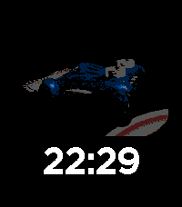

# van-face

A Pebble watchface that shows a rotating [Vangers](https://en.wikipedia.org/wiki/Vangers) mechos on a turntable above a big time readout. Built for the **Pebble Time 2** (`emery`); other platforms build cleanly but the layout is tuned for 200×228.



The rotation frames are extracted from the original Vangers shop videos (`mech00.avi`…`mech14.avi` in the game's `resource/video/` dir), composited onto black, quantized to Pebble's 64-color palette, and shipped as individual `png` resources that the C app swaps on tick.

## Quickstart

This project assumes the Pebble SDK is available. Either run from inside the included `nix-shell` (`shell.nix` handles all the NixOS patchelf gymnastics) or use the Core Devices SDK directly.

```sh
pebble build                              # build for all targetPlatforms
pebble install --emulator emery           # run in the emery emulator
pebble screenshot --emulator emery shot.png
```

To deploy to a real Pebble Time 2:

```sh
pebble login                              # GitHub OAuth, one-time
# pair the watch in the rePebble phone app, enable Developer Connection
pebble install --cloudpebble              # routes through the phone via cloud
# or, if the rePebble app exposes a LAN port:
pebble install --phone <phone-ip>
```

## Settings

The face uses [Clay](https://github.com/pebble-dev/clay) for in-app configuration. Long-press the watchface tile in the rePebble app → Settings:

- **Vehicle** — Random (new pick each wake), Sequential (cycles m1 → m14), or pin a specific mechos
- **Idle rotation** — how fast the mech spins when you're not looking (1 s … 1 min between frame advances; off disables)

Tap or wrist-raise puts the face into "active" mode for 5 s: the mech spins at **4 fps**. On deactivation, in random/sequential modes, the next vehicle is picked.

## Mechos roster

The 14 mechous in the game (`m1`–`m14`), with their Vangers nicknames as they appear in the in-game shop:

| Slug | Name | Body type |
|------|------|-----------|
| m1 | Iron Shadow | JEEP |
| m2 | Blade Keeper | MICROBUS |
| m3 | atTractor | MASH |
| m4 | Oxidize Monk | RETRO |
| m5 | Heavy Lady | DUMPER |
| m6 | Spread Spot | BAGGI |
| m7 | The Ripper | DRAGSTER |
| m8 | Ancient Demon | HAMMER |
| m9 | Arcan | OLDCAR |
| m10 | Mad Surgeon | ROADSTER |
| m11 | Zippax | SEDAN |
| m12 | Rivet Bier | TRACK |
| m13 | Piercator | UNIVERSL |
| m14 | Excorps | VAGON |

## Asset pipeline

```sh
# Regenerate frames for one mechos (rePebble nix-shell has ffmpeg + Pillow)
python tools/build_mech_frames.py \
  /path/to/VangersData/resource/video/mech06.avi \
  resources/images \
  --frames 6 --brightness 1.5 --zoom 1.25 --prefix m1
```

Each frame is a 200×150 paletted PNG (~3 KB on flash). 14 mechos × 6 frames ≈ 200 KB — fits emery's 256 KB resource budget with headroom.

## Layout

```
┌────────────────────┐
│ ████████ mech ████ │   ← 200×150 paletted bitmap (top, centered)
│ ████ on turntable ██│
│                    │
│   ██  ██:██  ██    │   ← BITHAM_42_BOLD time (bottom strip ~78 px)
└────────────────────┘
```

## Project layout

```
src/c/van-face.c          watchapp (window, bitmap layer, time, settings)
src/pkjs/index.js         3-line Clay loader (phone-side)
src/pkjs/config.js        Clay form definition
resources/images/         84 paletted PNG frames (m{1..14}_{01..06}.png)
tools/build_mech_frames.py  ffmpeg + Pillow extraction pipeline
package.json              Pebble manifest (UUID, capabilities, messageKeys, resources)
shell.nix                 Nix dev shell — patchelfs the SDK toolchain for NixOS
```

## Round-watch support (TODO)

Currently only `emery` is tuned. The 200-wide bitmaps don't fit chalk (180×180) or aplite/basalt/diorite/flint (144×168), and on gabbro (260×260 round) the mech is undersized. Per-platform asset sets via `targetPlatforms` in each resource entry is the right fix — not done yet.

## Publishing (TODO)

`pebble publish` from the project dir walks through metadata creation and uploads to `appstore-api.repebble.com`. Needs a small icon, large icon, and platform screenshots. Drafts live at <https://developer.repebble.com/dashboard>; add `--is-published` to release immediately.

## Acknowledgements

- [Vangers](https://store.steampowered.com/app/264080/Vangers/) by K-D LAB (1998) — source assets
- [`vange-rs`](https://github.com/kvark/vange-rs) — Rust port of the engine; the M3D → OBJ pipeline lives there
- [Pebble SDK](https://developer.repebble.com) — Core Devices' revival of the platform
- [Clay](https://github.com/pebble-dev/clay) — declarative config-page generator
